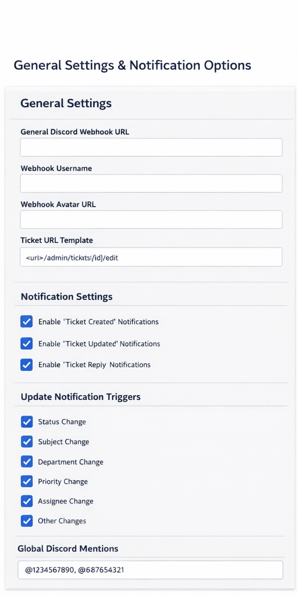
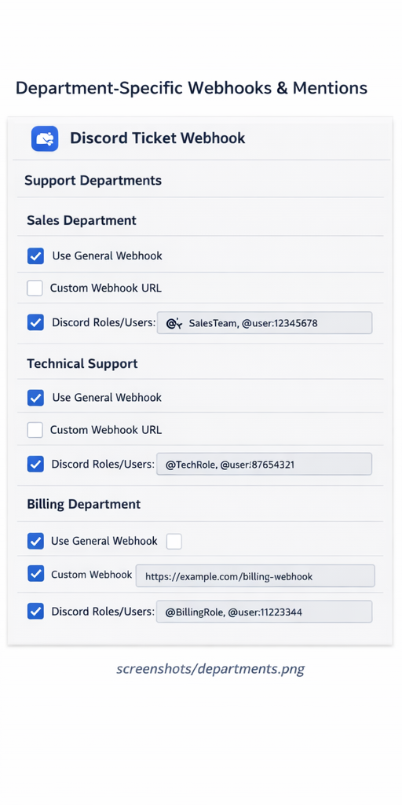
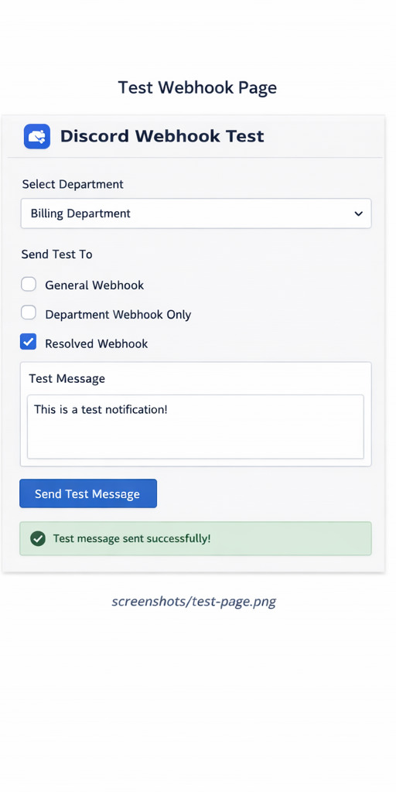

# Discord Ticket Webhook – Paymenter Extension


A powerful **Paymenter extension** that sends **Discord webhook notifications** for **all ticket activity**, with full control per **department**, **notification type**, **update type**, and **Discord mentions**.

---

## ✨ Features

### 📣 Ticket Notifications
- Ticket created  
- Ticket updated  
- Ticket reply posted  

Each notification type can be enabled or disabled individually.

### 🔎 Granular Update Detection
Enable/disable notifications for:
- Status changes
- Subject changes
- Department changes
- Priority changes
- Assignee changes
- Other changes

### 🧭 Department-aware Webhook Routing
- One **general Discord webhook**
- Optional **per-department webhook**
- Per department:
  - “Use general webhook” (default ON)
  - Custom webhook URL if disabled
- Automatic fallback to general webhook if a department webhook is missing

### 🔔 Advanced Discord Mentions
Supports:
- Global default mentions
- Per-department mentions
- Per-notification-type mentions (created / updated / reply)

Supported formats:
```
role:123456789012345678
user:987654321098765432
<@123456789012345678>
<@&987654321098765432>
```

Multiple mentions per department are fully supported.

### 🧪 Built-in Webhook Test Page
Includes an **Admin Test Page** where you can:
- Select a department
- Choose webhook routing (general / department / resolved)
- Send a test message
- Get instant success/error feedback

Admin menu location:
```
Support → Discord Webhook Test
```

### 🔗 Clickable Ticket Links
Each Discord message includes a direct admin link to the ticket.

---

## 🖼️ Screenshots

> Screenshots are examples. UI may vary slightly depending on Paymenter version.

### Extension Settings


### Per-Department Configuration


### Webhook Test Page


---

## 📦 Installation

1. Upload the extension to:
```
extensions/Others/DiscordTicketWebhook
```

2. From the Paymenter root directory, run:
```bash
composer dump-autoload
php artisan optimize:clear
```

3. Go to **Admin → Extensions** and enable **Discord Ticket Webhook**.

---

## ⚙️ Configuration Overview

### General
- General Discord Webhook URL (required)
- Optional username & avatar
- Ticket URL template

### Notification Toggles
- Ticket created
- Ticket updated
- Ticket reply posted

### Update Type Toggles
- Status
- Subject
- Department
- Priority
- Assignee
- Other

### Department Settings (Auto-generated)
- Use general webhook (default ON)
- Department-specific webhook URL
- Department-specific Discord mentions

### Mentions
- Global default mentions
- Extra mentions per notification type

---

## 🛡️ Compatibility & Safety
- Compatible with **Paymenter 1.4.7+**
- Model-agnostic department detection
- Safe fallbacks prevent lost notifications
- No core file modifications required

---

## 🚀 Use Cases
- Route billing tickets to finance Discord channels
- Ping engineers only for technical replies
- Keep status updates quiet but replies loud
- Different Discord servers per department

---

## 📄 License
MIT

---

## 🤝 Contributing / Customization
PRs and extensions are welcome.  
The extension is designed to be modular and easy to extend.
